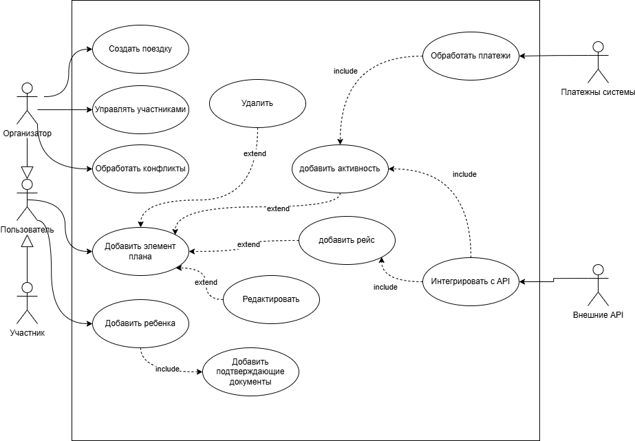
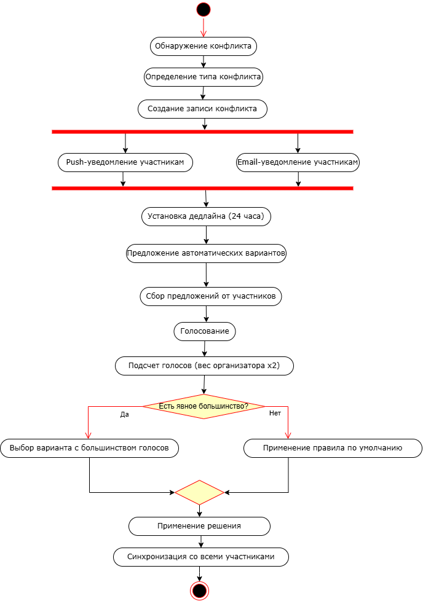
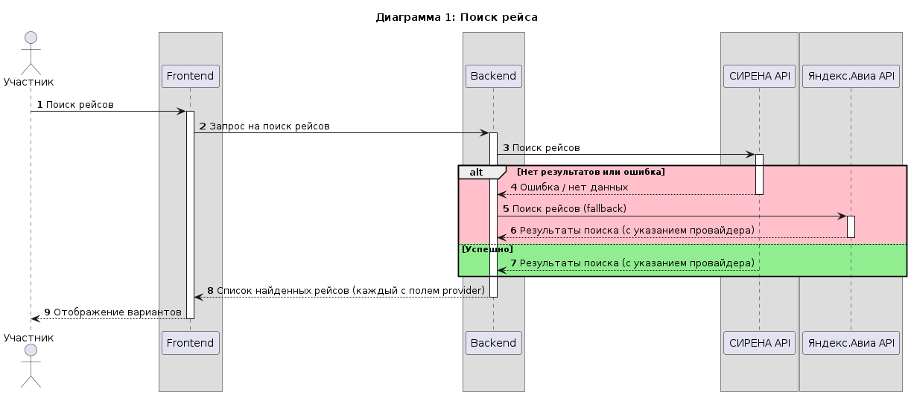
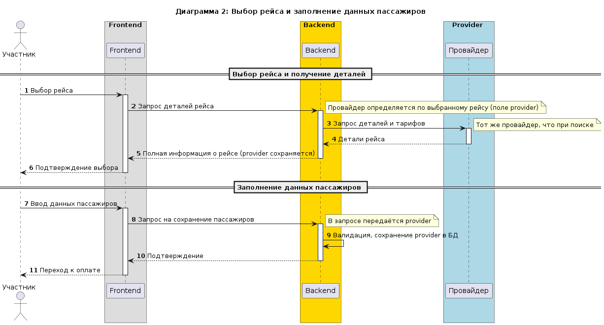
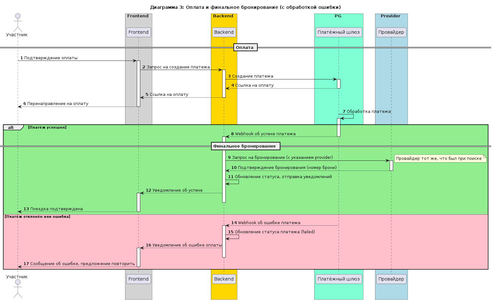
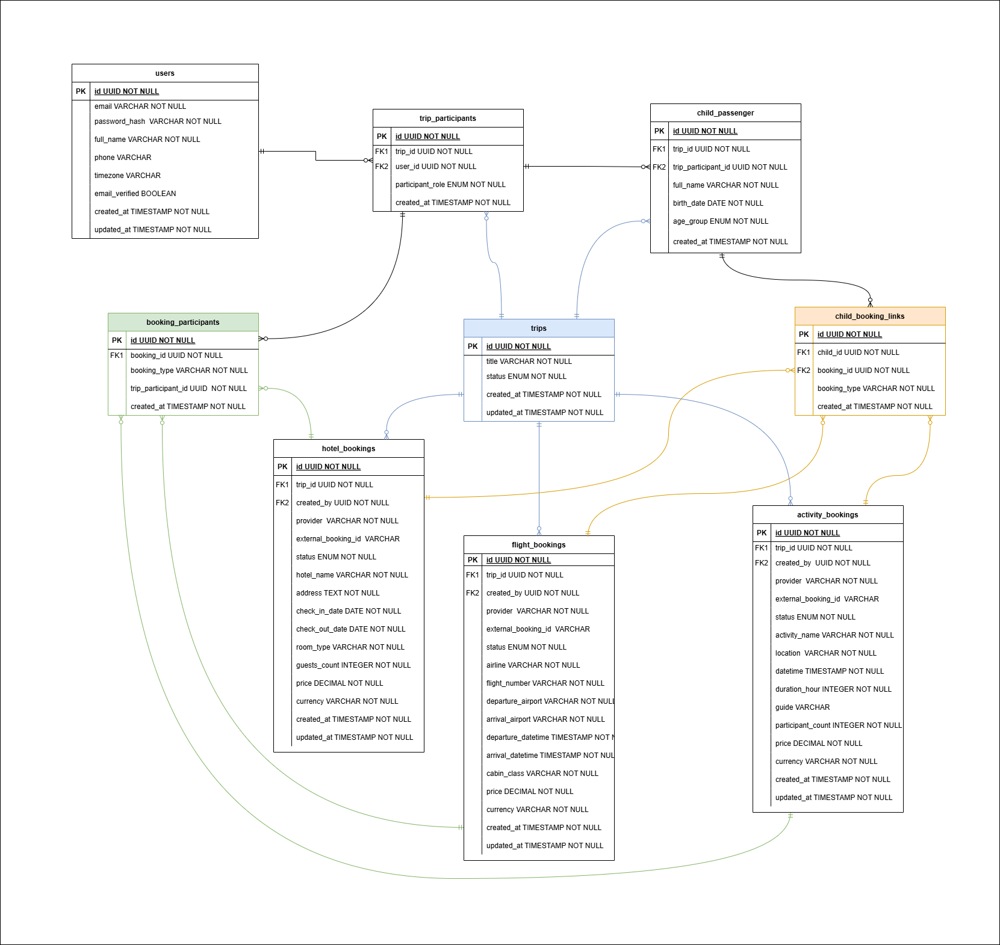

# Спецификация системы совместного планирования поездок TravelTech

**Версия:** 3.2 (финальная)  
**Дата:** 02.11.2025  
**Автор:** Системный аналитик  

---

## Содержание

1. [Обзор системы](#1-обзор-системы)  
2. [Архитектура и Use Cases](#2-архитектура-и-use-cases)  
3. [Бизнес-процессы](#3-бизнес-процессы)  
4. [Интеграции с внешними системами](#4-интеграции-с-внешними-системами)  
5. [Модель данных](#5-модель-данных)  
6. [Ролевая модель и безопасность](#6-ролевая-модель-и-безопасность)  
7. [API спецификация](#7-api-спецификация)  
8. [Требования](#8-требования)  
9. [Приложения](#приложения)  

---

## 1. Обзор системы

### 1.1 Назначение системы
Система обеспечивает согласованное совместное планирование групповых поездок, где несколько участников параллельно редактируют план поездки.

### 1.2 Ключевая задача
Обработка сценария, когда:
- один участник добавляет рейс;
- другой — отель;
- третий — активность;
- четвёртый редактирует или удаляет элемент.

**При этом:**
- участники могут быть в разных тайм-зонах и офлайн;
- все изменения доступны всем участникам;
- при конфликтах система предлагает стратегии слияния (merge);
- поддерживаются предложенные варианты и текущее состояние.

### 1.3 Особенности проектирования
- Многопользовательский режим для семейных/групповых поездок;
- Интеграции с внешними API с учётом российского контекста;
- Обработка платежей и документов;
- Работа с часовыми поясами и международными форматами;
- Персонализация без утечки данных.

---

## 2. Архитектура и Use Cases

### 2.1 Use Case диаграмма


*На диаграмме показаны акторы (Пользователь, Организатор, Участник, Внешние API) и основные прецеденты: создание поездки, добавление элементов (рейс, отель, активность), управление участниками, обработка конфликтов, интеграция с API.*

---

## 3. Бизнес-процессы

### 3.1 Процесс разрешения конфликтов


**Описание шагов:**
1. **Обнаружение** – система выявляет противоречие (например, два отеля на одни даты), определяет тип конфликта и создаёт запись.
2. **Уведомление** – участникам отправляются push и email-уведомления; устанавливается дедлайн 24 часа.
3. **Предложение вариантов** – система генерирует автоматические варианты, участники могут предлагать свои.
4. **Голосование** – каждый участник голосует; организатор имеет вес 2, участник – 1.
5. **Применение** – выбирается вариант с большинством голосов; при равенстве применяется правило по умолчанию (например, сохранить первый предложенный). Результат синхронизируется.

---

## 4. Интеграции с внешними системами

### 4.1 Детальные диаграммы последовательности

#### Диаграмма 1: Поиск рейса


**Пояснение:**  
При поиске сначала опрашивается основной провайдер (СИРЕНА). В случае ошибки или отсутствия данных выполняется fallback-запрос к Яндекс.Авиа. Каждый рейс возвращается с полем `provider`, которое будет использоваться на следующих этапах.

---

#### Диаграмма 2: Выбор рейса и заполнение данных пассажиров


**Пояснение:**  
После выбора рейса бэкенд запрашивает детали у того же провайдера, который нашёл рейс. При сохранении данных пассажиров провайдер также передаётся и сохраняется в БД, чтобы на этапе оплаты и бронирования использовать правильный источник.

---

#### Диаграмма 3: Оплата и финальное бронирование (с обработкой ошибки)


**Пояснение:**  
Платёжный шлюз обрабатывает платеж и уведомляет бэкенд через webhook. При успехе бэкенд выполняет финальное бронирование у того же провайдера, который использовался при поиске. При ошибке пользователь получает уведомление и может повторить попытку.

### 4.2 Матрица интеграций (российский контекст)

| Сервис     | Основной провайдер | Резервный           | Особенности                              |
|------------|---------------------|---------------------|------------------------------------------|
| Авиабилеты | СИРЕНА-Трэвел       | Яндекс.Авиа         | Поддержка всех российских авиакомпаний   |
| Отели      | Ostrovok.ru         | Яндекс.Путешествия  | Русскоязычная поддержка, рублёвые цены   |
| Активности | Sputnik8            | Weatlas             | Экскурсии на русском языке               |
| Платежи    | ЮKassa              | СБП                 | Поддержка российских карт, 152-ФЗ        |
| Карты      | Яндекс.Карты        | 2GIS                | Детализация РФ и СНГ                      |

---

## 5. Модель данных

### 5.1 Общая структура

Система использует реляционную базу данных. Основные сущности:

- **Пользователи** – зарегистрированные в системе люди.
- **Поездки** – групповые путешествия.
- **Участники поездок** – связь пользователей с поездками и их роли.
- **Дети** – информация о детях, путешествующих с участниками.
- **Бронирования** (рейсы, отели, активности) – элементы плана поездки.
- **Связующие таблицы** – для связи взрослых и детей с бронированиями.

Ниже представлена ER-диаграмма, отражающая логическую структуру базы данных (поля, ключи, связи, типы данных и ограничения NOT NULL).

 


### 5.2 Краткое описание таблиц

#### `users`
Хранит учётные записи пользователей. Ключевые поля: `id`, `email` (уникальный), `full_name`, `timezone` (для корректного отображения времени), `email_verified` (флаг подтверждения).

#### `trips`
Содержит информацию о поездках: название и статус (например, планирование, утверждена, завершена).

#### `trip_participants`
Связывает пользователей с поездками. Поле `participant_role` определяет, является ли участник организатором или обычным участником. Один пользователь может участвовать в нескольких поездках, но в каждой поездке только один раз.

#### `child_passengers`
Информация о детях, добавленных в поездку. Каждый ребёнок привязан к конкретному участнику (`trip_participant_id`). Возрастная группа (`age_group`) используется для применения тарифов.

#### `flight_bookings`, `hotel_bookings`, `activity_bookings`
Три таблицы для разных типов бронирований. Общие поля:

- `trip_id` – поездка, к которой относится бронирование.
- `created_by` – участник, добавивший элемент (инициатор).
- `provider` – внешний провайдер (например, 'sirena').
- `external_booking_id` – идентификатор у провайдера (заполняется после бронирования).
- `status` – жизненный цикл элемента (предложен, голосование, утверждён, забронирован и т.д.).
- `price`, `currency` – стоимость и валюта.

Остальные поля специфичны для каждого типа (например, `airline`, `flight_number` для рейсов; `hotel_name`, `check_in_date` для отелей; `activity_name`, `activity_datetime` для активностей).

#### `booking_participants`
Связующая таблица, определяющая, какие взрослые участники (`trip_participant_id`) участвуют в конкретном бронировании. Позволяет одному бронированию быть связанным с несколькими участниками (например, все члены группы, летящие одним рейсом). Поля `booking_id` и `booking_type` образуют полиморфную ссылку на одну из трёх таблиц бронирований.

#### `child_booking_links`
Аналогичная связующая таблица для детей (`child_id`). Определяет, какие дети участвуют в бронировании.

### 5.3 Перечень ENUM-типов
|ENUM-тип|Варианты значений|
|--------|-----------------|
| **`trip_status`**| `draft` (черновик), `planning` (планирование), `confirmed` (утверждена), `booking` (идёт бронирование), `booked` (всё забронировано), `active` (поездка идёт), `completed` (завершена), `cancelled` (отменена).|
| **`participant_role`**| `organizer`, `participant`.|
| **`age_group`**| `infant_0_2`, `child_3_12`, `teen_13_17`.|
| **`booking_status`**| `proposed` (предложен), `voting` (голосование), `approved` (утверждён), `booked` (забронирован), `cancelled` (отменён), `conflict` (конфликт).|
| **`booking_type`**| `flight`, `hotel`, `activity`.|

---

## 6. Ролевая модель и безопасность

### 6.1 Основные роли

| Право/Действие                   | Организатор | Участник |
|----------------------------------|-------------|----------|
| Создание поездки                 | ✅          | ❌       |
| Приглашение участников           | ✅          | ❌       |
| Утверждение финального плана     | ✅          | ❌       |
| Разрешение конфликтов (право вето)| ✅          | ❌       |
| Добавление ребёнка               | ✅          | ✅ (только своего) |
| Предложение элементов            | ✅          | ✅       |
| Голосование                      | ✅ (2 голоса)| ✅ (1 голос) |
| Редактирование своих элементов   | ✅          | ✅       |
| Офлайн-работа                    | ✅          | ✅       |
| Просмотр стоимости               | ✅ (вся)    | ✅ (общая + своя) |


### 6.2 Принцип "Персонализация без утечки данных"
- Предпочтения пользователя хранятся локально на устройстве.
- На сервер отправляются обезличенные паттерны для агрегированных рекомендаций.
- При необходимости используется дифференциальная приватность.

### 6.3 Обработка документов
- На этапе планирования – только имя и возраст ребёнка.
- При бронировании – запрос конкретных документов у провайдера.
- Хранение: шифрование AES-256, удаление через 30 дней после поездки.
- Маски документов отображаются в интерфейсе согласно формату страны.

---

## 7. API спецификация

### 7.1 Ключевые эндпоинты (все с префиксом `/api/v1`)

**Управление поездками**
- `POST /trips` – создать поездку
- `GET /trips/{id}` – получить поездку
- `PUT /trips/{id}` – обновить поездку
- `POST /trips/{id}/participants` – пригласить участника (только организатор)

**Синхронизация изменений**
- `POST /trips/{id}/sync` – синхронизировать изменения
- `GET /trips/{id}/changes` – получить изменения с timestamp

**Управление элементами**
- `POST /trips/{id}/flights` – добавить рейс (принимает provider, если рейс выбран из поиска)
- `POST /trips/{id}/hotels` – добавить отель
- `POST /trips/{id}/activities` – добавить активность
- `PUT /bookings/{type}/{id}` – редактировать элемент (type = flight, hotel, activity)
- `DELETE /bookings/{type}/{id}` – удалить элемент

**Конфликты и голосование**
- `GET /trips/{id}/conflicts` – список конфликтов
- `POST /conflicts/{id}/resolve` – разрешить конфликт (организатор)
- `POST /conflicts/{id}/vote` – проголосовать

**Дети в поездке**
- `POST /trips/{id}/children` – добавить ребёнка
- `DELETE /children/{id}` – удалить ребёнка
- `POST /children/{id}/link` – привязать к бронированию (передаётся booking_id и booking_type)

**Интеграции с провайдерами**
- `GET /providers/flights/search?from=MOW&to=AER&date=...`
- `GET /providers/hotels/search?city=Sochi&check_in=...`
- `GET /providers/activities/search?location=...`

### 7.2 Примеры запросов

**Добавление рейса с указанием провайдера**
```json
POST /api/v1/trips/trip_123/flights
{
  "provider": "sirena",
  "flight_number": "SU 1234",
  "departure_airport": "SVO",
  "arrival_airport": "AER",
  "departure_datetime": "2026-06-01T10:30:00",
  "arrival_datetime": "2026-06-01T13:45:00",
  "airline": "Aeroflot",
  "cabin_class": "economy",
  "price": 8500,
  "currency": "RUB"
}
```
**Добавление ребёнка**
```json
POST /api/v1/trips/trip_123/children
{
  "full_name": "Алексей",
  "birth_date": "2016-05-15"
}
```
Ответ:
```json
json
{
  "child_id": "child_456",
  "age_group": "child_3_12",
  "message": "Ребёнок добавлен. При бронировании потребуются документы.",
  "suggested_actions": [
    "Добавить в рейс Москва-Сочи",
    "Указать в отеле как дополнительного гостя"
  ]
}
```
**Привязка ребёнка к бронированию**

```json
POST /api/v1/children/child_456/link
{
  "booking_id": "flight_789",
  "booking_type": "flight"
}
```
## 8. Требования
### 8.1 Функциональные требования

**FR-01 Совместное редактирование**
| Код     | Описание |
|---------|----------|
|FR-01.01| Поддержка до 20 одновременных редакторов|
|FR-01.02| Real-time синхронизация изменений|
|FR-01.03| Оптимистичные блокировки элементов|
|FR-01.04| Полная история изменений|

**FR-02 Конфликт-менеджмент**
| Код     | Описание |
|---------|----------|
|FR-02.01| Автоматическое обнаружение временных конфликтов|
|FR-02.02| Выявление логических противоречий (рейс без отеля)|
|FR-02.03| Merge-стратегии при одновременных изменениях|
|FR-02.04| Голосование с разным весом голосов|
|FR-02.05| Автоматическое разрешение по дефолтным правилам|

**FR-03 Офлайн-работа**
| Код     | Описание |
|---------|----------|
|FR-03.01| Локальное хранение изменений|
|FR-03.02| Автоматическая синхронизация при соединении|
|FR-03.03| Разрешение конфликтов офлайн-изменений|
|FR-03.04| Индикация статуса синхронизации|

**FR-04 Интеграции**
| Код     | Описание |
|---------|----------|
|FR-04.01| Поиск рейсов через API (СИРЕНА, Яндекс.Авиа)|
|FR-04.02| Поиск отелей через API (Ostrovok.ru, Яндекс.Путешествия)|
|FR-04.03| Обработка платежей (ЮKassa, СБП)|
|FR-04.04| Fallback на ручной ввод при недоступности всех провайдеров|

**FR-05 Управление детьми**
| Код     | Описание |
|---------|----------|
|FR-05.01| Добавление детей с минимальными данными (имя + возраст)|
|FR-05.02| Привязка детей к бронированиям участников|
|FR-05.03| Контекстный запрос документов при бронировании|
|FR-05.04| Учёт возрастных групп в поиске и стоимости|

### 8.2 Нефункциональные требования
**Производительность** 
| Код     | Описание |
|---------|----------|
|NFR-01| Синхронизация изменений < 5 секунд|
|NFR-02| Поиск через API < 10 секунд|
|NFR-03| Поддержка 1000 одновременных поездок|
|NFR-04| Офлайн-данные хранятся 30 дней|

**Безопасность**
| Код     | Описание |
|---------|----------|
|NFR-05| Шифрование персональных данных (AES-256)|
|NFR-06| Соответствие 152-ФЗ и GDPR|
|NFR-07| Персонализация без утечки персональных данных|
|NFR-08| Автоматическое удаление документов после поездки|

**Надёжность**
| Код     | Описание |
|---------|----------|
|NFR-09| Доступность 99.5%|
|NFR-10| Резервные провайдеры для всех интеграций|
|NFR-11| Автоматическое восстановление при сбоях|
|NFR-12| Мониторинг всех внешних API|

**Удобство использования**
| Код     | Описание |
|---------|----------|
|NFR-13| Поддержка русского и английского языков|
|NFR-14| Адаптация форматов дат/валют по локали|
|NFR-15| Корректная работа с часовыми поясами|
|NFR-16| Мобильная и десктопная версии|

## 9. Приложения

### Статусы элементов и поездок
- **Элемент:** proposed, voting, approved, booked, cancelled, conflict

- **Поездка:** draft, planning, confirmed, booking, booked, active, completed, cancelled
