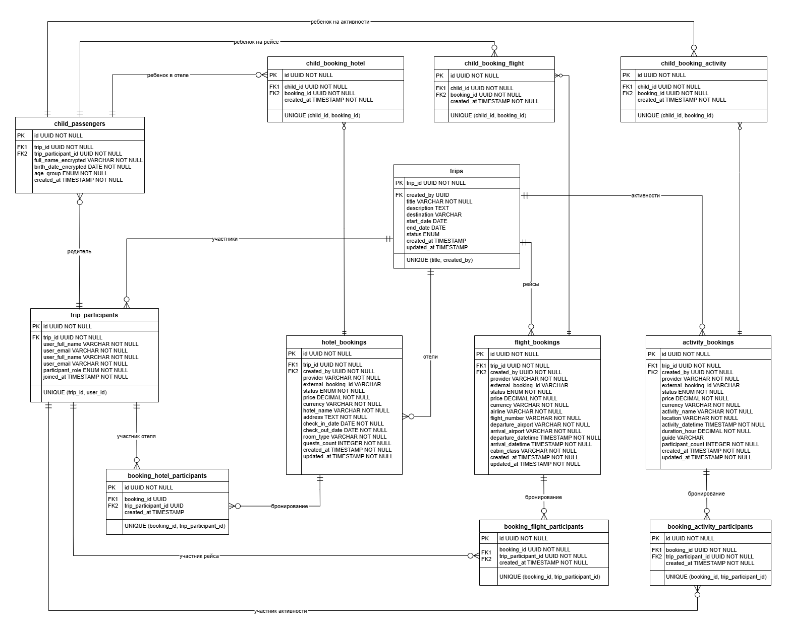
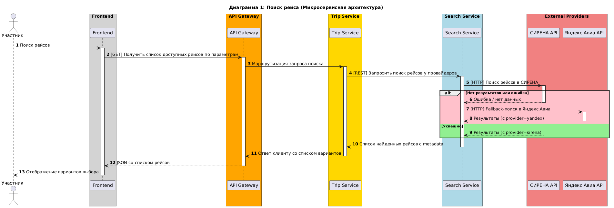
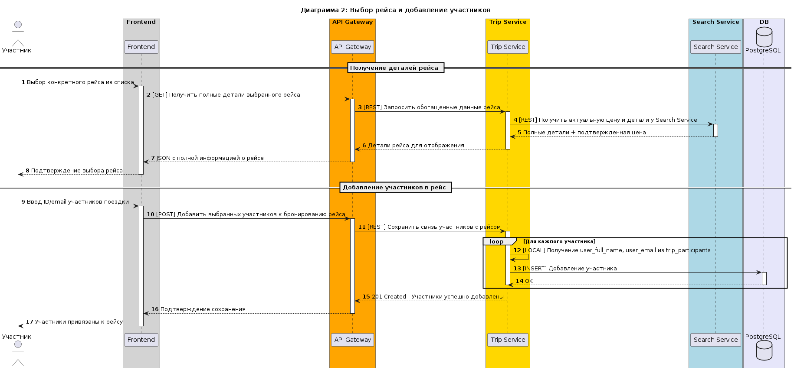
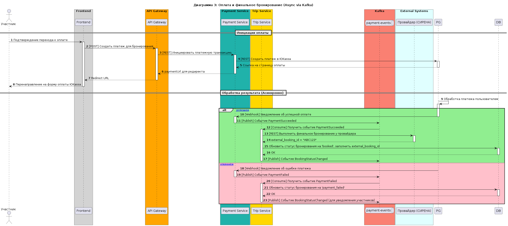
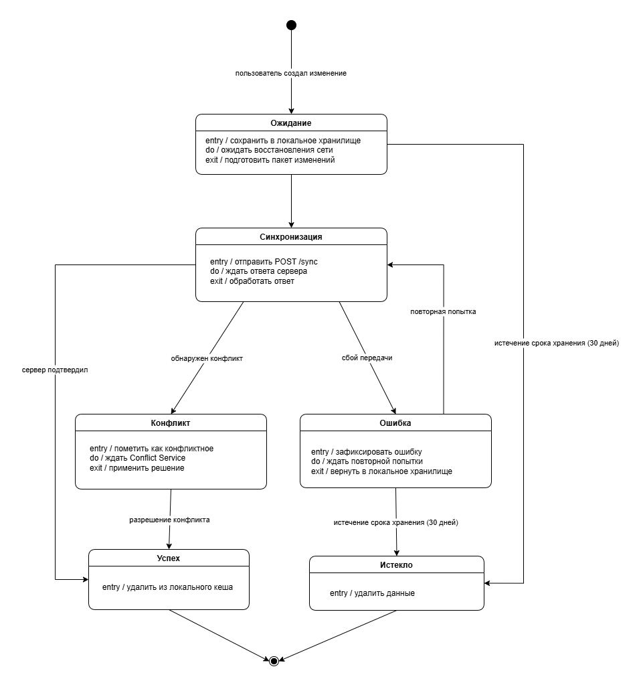

# Спецификация микросервиса Trip Service
## Название сервиса: Trip Service
### Версия: 1.0
### Владелец: Гулина Е.А.

## 1. Введение
### 1.1. Назначение
Trip Service — микросервис системы совместного планирования поездок TravelTech, отвечающий за управление жизненным циклом поездок, участниками, элементами плана (бронирования рейсов, отелей, активностей), а также обеспечивающий синхронизацию изменений между участниками и координацию с другими сервисами для выполнения оплаты и бронирования.
Данный документ описывает функциональные и нефункциональные требования, границы ответственности, модель данных, API-контракты и интеграции Trip Service. Документ предназначен для команды разработки, тестирования и архитекторов, работающих с интеграциями между сервисами.

### 1.2. Область применения
Trip Service является частью распределённой системы TravelTech и взаимодействует со следующими микросервисами:

**User Service** — управление пользователями и аутентификация

**Search Service** — поиск рейсов, отелей и активностей

**Payment Service** — обработка платежей

**Conflict Service** — разрешение конфликтов бронирований

**Notification Service** — отправка уведомлений пользователям

Trip Service не является самостоятельным продуктом и работает только в составе экосистемы TravelTech.

### 1.3. Определения и сокращения
|Термин|Определение|
|--|--|
|Поездка|Групповое путешествие, которое планируют несколько участников|
|Организатор|Пользователь, создавший поездку и управляющий её настройками (единственный на поездку)|
|Участник|Пользователь, приглашённый в поездку организатором|
|Бронирование|Элемент плана поездки (рейс, отель или активность)|
|Провайдер|Внешний сервис (СИРЕНА, Ostrovok, Яндекс.Авиа), через который выполняется бронирование|
|Kafka|Брокер сообщений для асинхронного взаимодействия между микросервисами|
|Database per Service|Архитектурный принцип, при котором каждый микросервис имеет собственную автономную БД|
|Денормализация|Хранение локальных копий данных из других сервисов для повышения производительности чтения|
|Eventual Consistency|Модель согласованности данных, при которой изменения распространяются асинхронно|
|MVP|Минимально жизнеспособный продукт (выпуск 1.0)|

### 1.4. Ссылки

**Нормативно-правовые акты Российской Федерации:**
- [Федеральный закон от 27.07.2006 № 152-ФЗ «О персональных данных»](http://www.consultant.ru/document/cons_doc_LAW_61801/)
- [Федеральный закон от 27.07.2006 № 149-ФЗ «Об информации, информационных технологиях и о защите информации»](http://www.consultant.ru/document/cons_doc_LAW_61798/)
- [Федеральный закон от 07.07.2003 № 126-ФЗ «О связи»](http://www.consultant.ru/document/cons_doc_LAW_43381/)
- [Гражданский кодекс Российской Федерации, статья 196 (срок исковой давности)](http://www.consultant.ru/document/cons_doc_LAW_5142/25e03b40c8e1254c51083e648afb0d34e2b4c7c7/)
- [Постановление Правительства РФ от 01.11.2012 № 1119 «Об утверждении требований к защите персональных данных при их обработке в информационных системах персональных данных»](http://www.consultant.ru/document/cons_doc_LAW_138412/)
- [Приказ ФСТЭК России от 18.02.2013 № 21 «Об утверждении состава и содержания организационных и технических мер по обеспечению безопасности персональных данных при их обработке в информационных системах персональных данных»](http://www.consultant.ru/document/cons_doc_LAW_162061/)

**Международные стандарты:**
- [General Data Protection Regulation (GDPR) — Регламент ЕС 2016/679](https://gdpr-info.eu/regulation/)
- [Payment Card Industry Data Security Standard (PCI DSS v4.0)](https://www.pcisecuritystandards.org/document_library)

**Технические стандарты и спецификации:**
- [OpenAPI Specification, Version 3.0.1](https://spec.openapis.org/oas/v3.0.1)
- [JSON Web Token (JWT), RFC 7519](https://datatracker.ietf.org/doc/html/rfc7519)
- [OAuth 2.0 Authorization Framework, RFC 6749](https://datatracker.ietf.org/doc/html/rfc6749)
- [Hypertext Transfer Protocol (HTTP/1.1), RFC 7231](https://datatracker.ietf.org/doc/html/rfc7231)
- [Uniform Resource Identifier (URI): Generic Syntax, RFC 3986](https://datatracker.ietf.org/doc/html/rfc3986)
- [JavaScript Object Notation (JSON), RFC 8259](https://datatracker.ietf.org/doc/html/rfc8259)
  
## 2. Описание сервиса
### 2.1. Назначение
Управление данными поездок, участниками, элементами плана, автоматическая синхронизация офлайн-изменений и координация финального бронирования через асинхронные события.

### 2.2. Границы ответственности
**Trip Service отвечает за:**
- Создание, изменение и удаление поездок, управление статусами (draft, planning, confirmed, booking, booked, active, completed, cancelled).
- Управление участниками: приглашение, удаление, назначение ролей. Роль организатора присваивается автоматически при создании поездки. В рамках одной поездки может быть только один организатор.
- Управление детьми: добавление детей, привязка к участникам, хранение возрастных групп для тарификации.
- Элементы плана: добавление, редактирование, удаление бронирований (рейсы, отели, активности), управление статусами (proposed, approved, booked, cancelled, payment_failed, conflict).
- Связи участников с элементами: привязка взрослых и детей к конкретным бронированиям.
- Автоматическую синхронизацию изменений: обработку пакетов офлайн-изменений, версионирование, фиксацию конфликтов (без участия пользователя).
- Хранение локальных копий данных пользователей (user_full_name, user_email) в таблице trip_participants для оптимизации чтения.
- Финальное бронирование у внешних провайдеров после получения события PaymentSucceeded.
- Расчёт суммы оплаты для инициации платежа (на основе элементов, где пользователь указан как участник).

**Trip Service НЕ отвечает за:**
- Регистрацию, аутентификацию, управление паролями и сессиями (User Service).
- Поиск и агрегацию предложений от провайдеров (Search Service).
- Обработку платежей, работу с платёжными шлюзами и транзакциями (Payment Service).
- Отправку email/push/SMS уведомлений (Notification Service).
- Выявление и алгоритмическое разрешение бизнес-конфликтов (Conflict Service).
- Хранение учётных записей пользователей и платёжных реквизитов.
  
### 2.3. Внешние зависимости

| Зависимость | Тип | Цель | Протокол | Примечание |
|-------------|-----|------|----------|------------|
| User Service | Синхронное | Валидация пользователя при добавлении в поездку | REST | GET /users/{id} |
| User Service | Асинхронное | Обновление локальных копий имён/email | Kafka | Потребление `UserUpdated` |
| Search Service | Синхронное | Обогащение данных выбранного элемента (цена, детали) | REST | Вызов при выборе пользователем |
| Payment Service | Асинхронное | Получение результата оплаты | Kafka | Потребление `PaymentSucceeded`, `PaymentFailed` |
| Conflict Service | Асинхронное | Применение решений по конфликтам | Kafka | Потребление `ConflictResolved` |
| СИРЕНА-Трэвел | Синхронное | Финальное бронирование рейсов | REST | Основной провайдер авиабилетов |
| Яндекс.Авиа | Синхронное | Финальное бронирование рейсов | REST | Резервный провайдер авиабилетов |
| Ostrovok.ru | Синхронное | Финальное бронирование отелей | REST | Основной провайдер отелей |
| Яндекс.Путешествия | Синхронное | Финальное бронирование отелей | REST | Резервный провайдер отелей |
| Sputnik8 | Синхронное | Финальное бронирование активностей | REST | Основной провайдер активностей |
| Tripster | Синхронное | Финальное бронирование активностей | REST | Резервный провайдер активностей |
| Kafka | Инфраструктурная | Асинхронный обмен событиями | Kafka | Брокер сообщений |
| PostgreSQL | Внутренняя | Хранение данных сервиса | SQL | Автономная БД |
| Redis | Инфраструктурная | Кеширование данных поездок и участников | Redis Protocol | TTL 5 минут, инвалидация через Kafka |

**Примечание:** Конкретные провайдеры для поиска определяются на уровне Search Service. Trip Service работает с провайдерами через поле `provider` в бронированиях (заполняется при добавлении элемента из результатов поиска) и вызывает их API напрямую для финального бронирования после получения события `PaymentSucceeded`.

Поддерживаемые значения поля `provider`:
- Авиабилеты: `sirena`, `yandex_avia`
- Отели: `ostrovok`, `yandex_travel`
- Активности: `sputnik8`, `tripster`

Fallback-стратегия при финальном бронировании: при недоступности основного провайдера Trip Service автоматически переключается на резервный (согласно НFT-TS-05).

## 2.4. Инфраструктура

Trip Service использует следующие инфраструктурные компоненты:

| Компонент | Назначение | Способ доступа |
|-----------|------------|----------------|
| **PostgreSQL** | Хранение данных сервиса (принцип Database per Service) | SQL (через драйвер языка) |
| **Redis** | Кеширование данных поездок и участников для ускорения чтения | Redis Protocol |
| **Kafka** | Брокер событий для асинхронного взаимодействия с другими сервисами | Publish/Consume |

**Примечание по Redis:**
- Используется для кеширования часто читаемых данных (список участников поездки, детали бронирований).
- TTL кеша — 5 минут.
- Инвалидация происходит через события Kafka (при изменении данных).
- При недоступности Redis сервис продолжает работать, обращаясь напрямую к PostgreSQL.

### 2.5. Модель данных

Ниже представлена ER-диаграмма, отражающая логическую структуру базы данных (поля, ключи, связи, типы данных и ограничения NOT NULL).

#### **Правила проектирования модели данных**

В соответствии с принципом *Database per Service*, база данных Trip Service является автономной. При проектировании схемы приняты следующие архитектурные решения:

1. **Локальные копии данных пользователей** 
   - В trip_participants хранятся user_full_name и user_email. 
   - Физический FK отсутствует. 
   - Синхронизация через UserUpdated.
2. **Строго типизированные связующие таблицы** 
   - Вместо полиморфных связей используются отдельные таблицы для каждого типа бронирования (booking_flight_participants, booking_hotel_participants, child_booking_flight и т.д.). Это обеспечивает независимую индексацию и упрощает запросы.
3. **Защита ПДн детей** 
   - Поля full_name_encrypted и birth_date_encrypted в child_passengers шифруются алгоритмом AES-256 на уровне приложения.
   -  Реализация соответствует НFT-TS-07.
  
#### **Описание ключевых таблиц**
#### `trips`
 Хранит информацию о поездках, где первичным ключом выступает поле trip_id, а также содержит данные о статусе поездки и её датах.
#### `trip_participants`
 Реализует связь между пользователями и поездками, определяя роль каждого участника как `organizer` или `participant`, при этом в рамках одной поездки ровно один участник может иметь роль организатора.
#### `child_passengers`
 Cодержит информацию о детях, которые привязаны к конкретным участникам поездки через внешний ключ.
#### `flight_bookings`, `hotel_bookings`, `activity_bookings`
 Хранят элементы плана поездки с типоспецифичными атрибутами для каждого вида бронирования, а также включают поле `external_booking_id`, которое остаётся пустым (NULL) до момента финального бронирования у внешнего провайдера.
#### `booking_flight_participants`, `booking_hotel_participants` и `booking_activity_participants`
Являются связующими для взрослых участников и реализуют отношения многие-ко-многим между бронированиями рейсов, отелей и активностей соответственно и взрослыми участниками поездки.
#### `child_booking_flight`, `child_booking_hotel` и `child_booking_activity`
Являются связующими для детей и реализуют отношения многие-ко-многим между бронированиями рейсов, отелей и активностей соответственно и детьми, путешествующими с участниками поездки.

### 2.6. API (REST)

**Управление поездками**

|Метод|URL|Назначение|
|-----|---|----------|
|`POST`|/api/v1/trips|**Создать поездку** *(создатель становится организатором)*|
|`GET`|/api/v1/trips/{id}|**Получить данные поездки**|
|`PATCH`|/api/v1/trips/{id}|**Обновить поездку** *(только организатор)*|
|`DELETE`|/api/v1/trips/{id}|**Удалить поездку** *(только организатор, только draft)*|
|`POST`|/api/v1/trips/{id}/participants|**Пригласить участника** *(только организатор)*|
|`DELETE`|/api/v1/trips/{id}/participants/{participantId}|**Удалить участника** *(организатор не может удалить себя)*|

**Синхронизация изменений**
|Метод|URL|Назначение|
|-----|---|----------|
|`POST`|/api/v1/trips/{id}/sync|**Отправить пакет офлайн-изменений** *(вызывается клиентским приложением автоматически при восстановлении соединения, без участия пользователя)*|
|`GET`|/api/v1/trips/{id}/changes|**Получить изменения с указанного timestamp**|

**Управление элементами плана**
|Метод|URL|Назначение|
|-----|---|----------|
|`POST`|/api/v1/trips/{id}/flights|**Добавить рейс**|
|`PATCH`|/api/v1/trips/{id}/flights/{id}|**Изменить рейс**|
|`DELETE`|/api/v1/trips/{id}/flights/{id}|**Удалить рейс**|
|`POST`|/api/v1/trips/{id}/hotels|**Добавить отель**|
|`PATCH`|/api/v1/trips/{id}/hotels/{id}|**Изменить отель**|
|`DELETE`|/api/v1/trips/{id}/hotels/{id}|**Удалить отель**|
|`POST`|/api/v1/trips/{id}/activities|**Добавить активность**|
|`PATCH`|/api/v1/trips/{id}/activities/{id}|**Изменить активность**|
|`DELETE`|/api/v1/trips/{id}/activities/{id}|**Удалить активность**|

**Дети в поездке**
|Метод|URL|Назначение|
|-----|---|----------|
|`POST`|/api/v1/trips/{id}/children|**Добавить ребёнка**|
|`DELETE`|/api/v1/trips/{id}/children/{id}|**Удалить ребёнка**|
|`POST`|/api/v1/trips/{id}/children/{id}/link|**Привязать ребёнка к бронированию**|

## 2.7. События (Kafka)

Trip Service публикует и потребляет события через Kafka для асинхронного взаимодействия с другими сервисами. Все события следуют единому паттерну оформления payload:

- **События создания** (`…Created`, `…Added`) — содержат полный набор данных новой сущности и идентификатор создателя.
- **События изменения** (`…Updated`, `BookingStatusChanged`) — содержат идентификатор инициатора (`changedBy`), список изменённых полей и timestamp. Конкретные значения полей потребитель при необходимости запрашивает по REST API.
- **События удаления** (`…Removed`, `…Deleted`) — содержат идентификатор инициатора (`removedBy` / `deletedBy`) и timestamp.

### 2.7.1. Публикуемые события (Trip Service → Kafka)

#### Управление поездками

| Название | Описание | Потребители | Схема данных (payload) | Пример |
| --- | --- | --- | --- | --- |
| `TripCreated` | Создана новая поездка | Notification, Conflict | `tripId: UUID, organizerId: UUID, title: string, createdAt: datetime` | `{ "tripId": "t1", "organizerId": "u1", "title": "Сочи", "createdAt": "2026-06-01T10:00:00Z" }` |
| `TripUpdated` | Изменены данные поездки | Notification, Conflict | `tripId: UUID, changedBy: UUID, changedFields: array<string>, updatedAt: datetime` | `{ "tripId": "t1", "changedBy": "u1", "changedFields": ["status", "endDate"], "updatedAt": "2026-06-02T12:00:00Z" }` |
| `TripDeleted` | Поездка удалена организатором | Notification, Conflict | `tripId: UUID, deletedBy: UUID, deletedAt: datetime` | `{ "tripId": "t1", "deletedBy": "u1", "deletedAt": "2026-06-05T10:00:00Z" }` |

#### Управление участниками

| Название | Описание | Потребители | Схема данных (payload) | Пример |
| --- | --- | --- | --- | --- |
| `ParticipantAdded` | Добавлен участник в поездку | Notification, Conflict | `tripId: UUID, participantId: UUID, userId: UUID, role: string, addedAt: datetime` | `{ "tripId": "t1", "participantId": "p1", "userId": "u2", "role": "participant", "addedAt": "2026-06-02T10:00:00Z" }` |
| `ParticipantRemoved` | Участник удалён из поездки | Notification, Conflict | `tripId: UUID, participantId: UUID, userId: UUID, removedBy: UUID, removedAt: datetime` | `{ "tripId": "t1", "participantId": "p1", "userId": "u2", "removedBy": "u1", "removedAt": "2026-06-05T10:00:00Z" }` |

#### Управление элементами плана — рейсы

| Название | Описание | Потребители | Схема данных (payload) | Пример |
| --- | --- | --- | --- | --- |
| `FlightAdded` | Добавлен рейс в план поездки | Notification, Conflict | `tripId: UUID, flightId: UUID, userId: UUID, flightNumber: string, departureTime: datetime, arrivalTime: datetime, provider: string, addedAt: datetime` | `{ "tripId": "t1", "flightId": "f1", "userId": "u1", "flightNumber": "SU123", "departureTime": "2026-07-01T10:00:00Z", "arrivalTime": "2026-07-01T13:00:00Z", "provider": "sirena", "addedAt": "2026-06-02T10:00:00Z" }` |
| `FlightUpdated` | Изменены данные рейса | Notification, Conflict | `tripId: UUID, flightId: UUID, changedBy: UUID, changedFields: array<string>, updatedAt: datetime` | `{ "tripId": "t1", "flightId": "f1", "changedBy": "u1", "changedFields": ["departureTime"], "updatedAt": "2026-06-05T09:00:00Z" }` |
| `FlightRemoved` | Рейс удалён из плана поездки | Notification, Conflict | `tripId: UUID, flightId: UUID, removedBy: UUID, removedAt: datetime` | `{ "tripId": "t1", "flightId": "f1", "removedBy": "u1", "removedAt": "2026-06-05T10:00:00Z" }` |

#### Управление элементами плана — отели

| Название | Описание | Потребители | Схема данных (payload) | Пример |
| --- | --- | --- | --- | --- |
| `HotelAdded` | Добавлен отель в план поездки | Notification, Conflict | `tripId: UUID, hotelId: UUID, userId: UUID, hotelName: string, checkInDate: date, checkOutDate: date, provider: string, addedAt: datetime` | `{ "tripId": "t1", "hotelId": "h1", "userId": "u1", "hotelName": "Radisson", "checkInDate": "2026-07-01", "checkOutDate": "2026-07-07", "provider": "ostrovok", "addedAt": "2026-06-02T10:00:00Z" }` |
| `HotelUpdated` | Изменены данные отеля | Notification, Conflict | `tripId: UUID, hotelId: UUID, changedBy: UUID, changedFields: array<string>, updatedAt: datetime` | `{ "tripId": "t1", "hotelId": "h1", "changedBy": "u1", "changedFields": ["checkOutDate"], "updatedAt": "2026-06-05T09:00:00Z" }` |
| `HotelRemoved` | Отель удалён из плана поездки | Notification, Conflict | `tripId: UUID, hotelId: UUID, removedBy: UUID, removedAt: datetime` | `{ "tripId": "t1", "hotelId": "h1", "removedBy": "u1", "removedAt": "2026-06-05T10:00:00Z" }` |

#### Управление элементами плана — активности

| Название | Описание | Потребители | Схема данных (payload) | Пример |
| --- | --- | --- | --- | --- |
| `ActivityAdded` | Добавлена активность в план поездки | Notification, Conflict | `tripId: UUID, activityId: UUID, userId: UUID, activityName: string, datetime: datetime, provider: string, addedAt: datetime` | `{ "tripId": "t1", "activityId": "a1", "userId": "u1", "activityName": "Экскурсия", "datetime": "2026-07-03T09:00:00Z", "provider": "sputnik8", "addedAt": "2026-06-02T10:00:00Z" }` |
| `ActivityUpdated` | Изменены данные активности | Notification, Conflict | `tripId: UUID, activityId: UUID, changedBy: UUID, changedFields: array<string>, updatedAt: datetime` | `{ "tripId": "t1", "activityId": "a1", "changedBy": "u1", "changedFields": ["datetime"], "updatedAt": "2026-06-05T09:00:00Z" }` |
| `ActivityRemoved` | Активность удалена из плана поездки | Notification, Conflict | `tripId: UUID, activityId: UUID, removedBy: UUID, removedAt: datetime` | `{ "tripId": "t1", "activityId": "a1", "removedBy": "u1", "removedAt": "2026-06-05T10:00:00Z" }` |

#### Управление детьми

| Название | Описание | Потребители | Схема данных (payload) | Пример |
| --- | --- | --- | --- | --- |
| `ChildAdded` | Добавлен ребёнок в поездку | Notification | `tripId: UUID, childId: UUID, parentParticipantId: UUID, ageGroup: string, addedAt: datetime` | `{ "tripId": "t1", "childId": "c1", "parentParticipantId": "p1", "ageGroup": "child_3_12", "addedAt": "2026-06-05T10:00:00Z" }` |
| `ChildRemoved` | Ребёнок удалён из поездки | Notification | `tripId: UUID, childId: UUID, parentParticipantId: UUID, removedAt: datetime` | `{ "tripId": "t1", "childId": "c1", "parentParticipantId": "p1", "removedAt": "2026-06-05T10:00:00Z" }` |
| `ChildLinked` | Ребёнок привязан к бронированию | Notification | `tripId: UUID, childId: UUID, bookingId: UUID, bookingType: string, linkedAt: datetime` | `{ "tripId": "t1", "childId": "c1", "bookingId": "f1", "bookingType": "flight", "linkedAt": "2026-06-05T10:00:00Z" }` |

#### Статусы бронирований

| Название | Описание | Потребители | Схема данных (payload) | Пример |
| --- | --- | --- | --- | --- |
| `BookingStatusChanged` | Изменён статус бронирования | Notification, Conflict | `bookingId: UUID, bookingType: string, changedBy: UUID, oldStatus: string, newStatus: string, externalBookingId: string (nullable), updatedAt: datetime` | `{ "bookingId": "f1", "bookingType": "flight", "changedBy": "payment-service", "oldStatus": "approved", "newStatus": "booked", "externalBookingId": "ABC123", "updatedAt": "2026-06-15T14:30:00Z" }` |

> **Примечание.** Значение `changedBy` в событии `BookingStatusChanged` может содержать как идентификатор пользователя, так и идентификатор сервиса-инициатора (например, `payment-service`, `conflict-service`).

### 2.7.2. Потребляемые события (Kafka → Trip Service)

| Название | Описание | Источник | Действие Trip Service |
| --- | --- | --- | --- |
| `UserUpdated` | Изменены данные пользователя | User Service | Обновить `user_full_name` и `user_email` в `trip_participants` для всех записей с соответствующим `user_id`. |
| `PaymentSucceeded` | Платёж успешен | Payment Service | Вызвать API внешнего провайдера для финального бронирования, обновить статус бронирования на `booked`, заполнить `external_booking_id`. |
| `PaymentFailed` | Платёж отклонён | Payment Service | Обновить статус бронирования на `payment_failed`, опубликовать событие `BookingStatusChanged`. |
| `ConflictResolved` | Конфликт разрешён | Conflict Service | Применить решение к поездке (удалить дублирующее бронирование, обновить статусы). |

### 2.8.1. Ключевые сценарии

Ниже приведены диаграммы последовательности (Sequence Diagrams) для основных бизнес-процессов сервиса:

**Поиск рейса**: взаимодействие клиента, Trip Service и Search Service для получения предложений от провайдеров.  

**Выбор рейса и добавление участников**: процесс выбора пользователем конкретного рейса из результатов поиска, привязки участников и сохранения элемента в плане поездки.  
 
**Оплата и финальное бронирование**: асинхронный процесс получения события `PaymentSucceeded` от Payment Service и вызова API внешнего провайдера для подтверждения бронирования.  
 

### 2.8.2. Жизненный цикл офлайн-изменения

Процесс синхронизации локальных изменений описывается диаграммой состояний (State Machine Diagram). Диаграмма отражает поведение клиентского приложения и Trip Service при работе пользователя в офлайн-режиме и последующем восстановлении соединения.

#### Описание состояний

| Состояние | Описание |
| :--- | :--- |
| **Ожидание** | Изменение создано пользователем и сохранено в локальном хранилище устройства. Система ожидает восстановления сетевого соединения. |
| **Синхронизация** | Пакет локальных изменений отправлен на сервер Trip Service через API `/sync`. Система ожидает ответа. |
| **Успех** | Сервер подтвердил применение изменений. Локальная копия данных удаляется. |
| **Конфликт** | На сервере обнаружено противоречие версий. Требуется разрешение через Conflict Service. |
| **Ошибка** | Произошёл сбой передачи данных (таймаут, ошибка сети или 5xx ответ сервера). Выполняется автоматическая повторная попытка. |
| **Истекло** | Превышен максимальный срок хранения офлайн-данных (30 дней). Данные удаляются из локального хранилища. |

#### Логика переходов

| Состояние | Описание |
| :--- | :--- |
|**Ожидание → Синхронизация**|автоматически при восстановлении сетевого соединения.|
| **Синхронизация → Успех**| сервер подтвердил применение изменений.|
| **Синхронизация → Конфликт**| сервер вернул статус `409 Conflict` или выявил пересечение версий.|
| **Синхронизация → Ошибка**| таймаут или ошибка сети.|
| **Ошибка → Ожидание**| после неудачной повторной попытки изменение возвращается в локальное хранилище для следующей попытки.|
| **Ожидание / Ошибка → Истекло**| если с момента создания изменения прошло более 30 дней.|
| **Конфликт → Успех**| после получения события `ConflictResolved` от Conflict Service.|

## 2.9. Нефункциональные требования

### Производительность

| Код | Формулировка требования | Метрика |
| --- | --- | --- |
| **NFT-TS-01** | Система должна обрабатывать запросы на создание и обновление элементов поездки (CRUD) за время не более 500 мс (p95). | p95 < 500 мс |
| **NFT-TS-02** | Система должна обеспечивать поддержку до 20 одновременных редакторов одной поездки без деградации производительности. | 20 одновременных редакторов, отклик ≤ 500 мс |
| **NFT-TS-03** | Система должна выполнять синхронизацию офлайн-изменений при восстановлении связи за время не более 2 секунд. | ≤ 2 секунды |

### Надёжность и отказоустойчивость

| Код | Формулировка требования | Метрика |
| --- | --- | --- |
| **NFT-TS-04** | Система должна обеспечивать доступность сервиса на уровне 99.5% в рабочее время. | 99.5% uptime |
| **NFT-TS-05** | При недоступности внешних API провайдеров система должна сохранять локальный статус бронирования и автоматически повторять попытку бронирования при восстановлении связи. | 3 retry с экспоненциальной задержкой |
| **NFT-TS-06** | Система должна гарантировать доставку событий в Kafka с использованием паттерна Outbox. | Outbox pattern, 100% доставка |

### Безопасность

| Код | Формулировка требования | Метрика |
| --- | --- | --- |
| **NFT-TS-07** | Система должна шифровать персональные данные детей (ФИО, дата рождения) алгоритмом AES-256 на уровне приложения (соответствие 152-ФЗ). | AES-256, соответствие 152-ФЗ |
| **NFT-TS-08** | Система не должна использовать прямые ссылки (Foreign Key) на таблицы других сервисов в базе данных. | 0 физических FK на внешние сервисы |

## 2.10. Функциональные требования

### 2.10.1. Управление поездками

Блок обеспечивает создание, редактирование и удаление поездок. Организатор — единственный пользователь, имеющий право изменять общие параметры поездки и удалять её.

| Код | Формулировка требования | Приоритет |
| --- | --- | --- |
| **FT-TS-01** | Пользователь должен иметь возможность создать поездку, указав название, дату начала и дату окончания. | Высокий |
| **FT-TS-02** | Организатор должен иметь возможность изменять название, даты и статус поездки. | Высокий |
| **FT-TS-03** | Организатор должен иметь возможность удалить поездку, находящуюся на этапе подготовки. | Высокий |

### 2.10.2. Участники поездки

Блок обеспечивает приглашение и удаление участников, а также отображение их данных без синхронных вызовов к другим сервисам.

| Код | Формулировка требования | Приоритет |
| --- | --- | --- |
| **FT-TS-04** | Организатор должен иметь возможность приглашать пользователей в поездку. | Высокий |
| **FT-TS-05** | Организатор должен иметь возможность удалить участника из поездки. | Высокий |
| **FT-TS-06** | Система должна запрещать удаление участника с ролью организатора. | Высокий |

### 2.10.3. Элементы плана (рейсы, отели, активности)

Блок обеспечивает добавление, редактирование и удаление элементов плана поездки.

| Код | Формулировка требования | Приоритет |
| --- | --- | --- |
| **FT-TS-07** | Участник или организатор должен иметь возможность добавлять рейсы, отели и активности в план поездки. | Высокий |
| **FT-TS-08** | Автор элемента или организатор должен иметь возможность редактировать данные элемента плана. | Высокий |
| **FT-TS-09** | Автор элемента или организатор должен иметь возможность удалить элемент плана из поездки. | Высокий |
| **FT-TS-10** | Система должна запрещать удаление элемента плана, для которого уже выполнено финальное бронирование у внешнего провайдера. | Высокий |
| **FT-TS-11** | Система должна учитывать провайдера при бронировании элемента плана. | Высокий |

### 2.10.4. Привязка участников и детей к бронированиям

Блок обеспечивает привязку взрослых участников и детей к конкретным элементам плана для расчёта стоимости.

| Код | Формулировка требования | Приоритет |
| --- | --- | --- |
| **FT-TS-12** | Пользователь должен иметь возможность привязывать участников поездки к конкретным бронированиям. | Высокий |
| **FT-TS-13** | Пользователь должен иметь возможность привязывать детей к конкретным бронированиям с учётом возрастных ограничений провайдера. | Высокий |

### 2.10.5. Управление детьми

Блок обеспечивает добавление и удаление детей в поездке, автоматическое определение возрастной группы и защиту персональных данных детей.

| Код | Формулировка требования | Приоритет |
| --- | --- | --- |
| **FT-TS-14** | Участник или организатор должен иметь возможность добавить ребёнка в поездку, указав имя и дату рождения. | Высокий |
| **FT-TS-15** | Система должна автоматически определять возрастную группу ребёнка на основе даты рождения. | Высокий |
| **FT-TS-16** | Родитель ребёнка или организатор должен иметь возможность удалить ребёнка из поездки. | Высокий |

### 2.10.6. Синхронизация и офлайн-работа

Блок обеспечивает автоматическую синхронизацию изменений, накопленных клиентским приложением в офлайн-режиме, при восстановлении сетевого соединения.

| Код | Формулировка требования | Приоритет |
| --- | --- | --- |
| **FT-TS-17** | Система должна принимать пакет офлайн-изменений от клиентского приложения и применять их к данным поездки. | Высокий |
| **FT-TS-18** | При обнаружении конфликта версий система должна зафиксировать конфликт и инициировать его разрешение. | Высокий |

### 2.10.7. Финальное бронирование и оплата

Блок обеспечивает автоматическое бронирование у внешних провайдеров после успешной оплаты и применение решений Conflict Service.

| Код | Формулировка требования | Приоритет |
| --- | --- | --- |
| **FT-TS-19** | После успешной оплаты система должна автоматически выполнить бронирование у внешнего провайдера. | Высокий |
| **FT-TS-20** | При получении решения о разрешении конфликта система должна применить его к поездке. | Высокий |
| **FT-TS-21** | Участник должен иметь возможность оплатить только те элементы плана, в которых он указан как участник. | Высокий |
| **FT-TS-22** | Система должна рассчитывать сумму оплаты на основе привязок участника к бронированиям. | Высокий |

> **Примечание к FT-TS-22:** Для MVP применяются следующие правила расчёта стоимости:
> - Если элемент связан с несколькими участниками, стоимость делится поровну между ними.
> - Дети учитываются в стоимости через родителя, который их добавил.
> - Split-платежи, частичная оплата и совместная оплата за других участников не поддерживаются.

## Приложения
### **Приложение A. Ролевая модель**
|Право/Действие|Любой пользователь|Организатор (1 на поездку)|Участник|
|--------------|------------------|--------------------------|--------|
|Создать поездку и стать её организатором|✅| — | — |
|Редактировать название, даты, статус поездки| — | ✅ | ❌ |
|Удалить поездку (только в статусе draft)| — | ✅ | ❌ |
|Приглашать участников| — | ✅ | ❌ |
|Удалять участников| — | ✅ (кроме себя) | ❌ |
|Удалить себя из поездки| — | ❌ | ✅ | 
|Добавлять элементы плана| — | ✅ | ✅ |
|Редактировать/удалять свои элементы| — | ✅ | ✅ |
|Добавлять детей| — | ✅ | ✅ (только своих)|
|Оплачивать свои элементы| — | ✅ | ✅ |
|Просматривать данные поездки| — | ✅ | ✅ |

### **Приложение B. Сценарии использования (Use Cases)**
*Примечание: В данном приложении представлены основные и наиболее показательные сценарии использования (Use Cases), детализирующие ключевые бизнес-процессы системы.*

### UC-01: Создание поездки

| Поле | Описание |
| ---- | -------- |
| **ID** | UC-01 |
| **Действующие лица** | Пользователь |
| **Триггер** | Пользователь инициирует создание новой поездки. |
| **Предусловие** | Пользователь прошёл авторизацию в системе. |

 

**Основной поток** 

1. Система запрашивает у пользователя параметры поездки: название, дата начала, дата окончания.
2. Пользователь вводит параметры.
3. **Если** параметры соответствуют требованиям, система создаёт поездку.
4. Система назначает пользователя единственным организатором созданной поездки.
5. Система открывает страницу созданной поездки для дальнейшего планирования.
6. Вариант использования завершается.

 

**Альтернативный поток** 

**3А.1 Параметры не соответствуют требованиям:**
1. Система обнаруживает ошибку в данных (например, дата начала позже даты окончания).
2. Система отображает подсказку о требуемом формате.
3. Управление передаётся шагу 2 основного потока.

**3А.2 Поездка с таким названием уже существует:**
1. Система обнаруживает, что у пользователя уже есть активная поездка с таким названием.
2. Система отображает сообщение: «Поездка с таким названием уже существует».
3. Управление передаётся шагу 2 основного потока.

 

**Поток исключений** 

**3И. Ошибка сохранения данных:** 

1. Система не может сохранить данные о поездке.
2. Система отображает сообщение: «Не удалось создать поездку. Попробуйте позже».
3. Вариант использования завершается.

|     |     |
| --- | --- |
| **Постусловие** | Поездка создана на этапе подготовки (черновик), пользователь назначен единственным организатором. |
| **Результат** | Пользователь получает доступ к управлению созданной поездкой. |

 

### UC-02: Добавление рейса в поездку

| Поле | Описание |
| ---- | -------- |
| **ID** | UC-02 |
| **Действующие лица** | Пользователь |
| **Триггер** | Пользователь выбирает рейс из результатов поиска и добавляет его в план поездки. |
| **Предусловие** | Поездка существует, пользователь является участником или организатором поездки, рейс выбран из результатов поиска. |

 

**Основной поток** 

1. Пользователь инициирует добавление выбранного рейса в план поездки.
2. **Если** данные рейса корректны (заполнены обязательные поля, даты в будущем, указан сервис бронирования), система добавляет рейс в общий план поездки как предложенный вариант.
3. Система отмечает пользователя как автора этого предложения.
4. Система отображает добавленный рейс в плане поездки.
5. Вариант использования завершается.

 

**Альтернативный поток** 

**2А. Обнаружен конфликт по времени:**
1. Система обнаруживает пересечение с существующим рейсом или активностью в плане поездки.
2. Система помечает рейс как конфликтный.
3. Управление передаётся шагу 4 основного потока.

 

**Поток исключений** 

**2И.1 Некорректные данные:**
1. Система обнаруживает ошибку проверки данных рейса.
2. Система отображает сообщение с описанием ошибки.
3. Вариант использования завершается.
   
**2И.2 Ошибка сохранения данных:**
1. Система не может добавить рейс в план из-за технического сбоя.
2. Система отображает сообщение: «Не удалось добавить рейс. Попробуйте позже».
3. Вариант использования завершается.

|     |     |
| --- | --- |
| **Постусловие** | Рейс добавлен в план как предложенный вариант (или помечен как конфликтный). |
| **Результат** | Рейс добавлен в план поездки и доступен для просмотра всеми участниками. |

### UC-03: Оплата элементов поездки

| Поле | Описание |
| :--- | :--- |
| **ID** | UC-03 |
| **Действующие лица** | Пользователь |
| **Триггер** | Пользователь инициирует оплату своих утверждённых элементов. |
| **Предусловие** | Пользователь авторизован; поездка существует; в плане поездки есть согласованные элементы, в которых участвует данный пользователь. |

 

**Основной поток** 

1. Пользователь выбирает элементы для оплаты и подтверждает действие.
2. **Если** пользователь выбрал хотя бы один согласованный элемент, система рассчитывает сумму к оплате на основе его доли.
3. **Если** сумма корректна, система формирует платёж через сервис обработки платежей.
4. Система предоставляет пользователю доступ к странице оплаты.
5. Вариант использования завершается. *(Оплата и бронирование происходят асинхронно)*

 

**Альтернативный поток** 

**3А. Основной способ оплаты недоступен:**
1. Система обнаруживает ошибку при обращении к основному способу оплаты.
2. Система автоматически переключается на резервный способ оплаты.
3. Управление передаётся шагу 4 основного потока.

 

**Поток исключений** 

**2И. Нет элементов для оплаты:**
1. Система определяет отсутствие согласованных элементов, привязанных к пользователю.
2. Система информирует пользователя об отсутствии доступных для оплаты элементов.
3. Вариант использования завершается.
   
**3И. Сервис оплаты недоступен:**
1. Система не может сформировать платёж ни через основной, ни через резервный способ.
2. Система информирует пользователя о временной недоступности сервиса оплаты.
3. Вариант использования завершается.

**4И.1 Оплата не завершена:**
1. Пользователь прервал процедуру оплаты или не завершил её в отведённое время.
2. Система отображает информацию о незавершённой оплате и предлагает повторить попытку.
3. Вариант использования завершается.
   
**4И.2 Платёж отклонён:**
1. Сервис обработки платежей сообщает об отказе в проведении операции.
2. Система отмечает элемент как ошибка оплаты.
3. Система информирует пользователя об отказе и предлагает выбрать другой способ оплаты.
4. Вариант использования завершается.

|     |     |
| --- | --- |
| **Постусловие** | Платёж инициирован. При успешной оплате элементы автоматически переводятся в состояние подтверждённого бронирования (асинхронно). При ошибке — отмечаются как ошибка оплаты. |
| **Результат** | Пользователь получил доступ к оплате или понятное сообщение об ошибке/недоступности. |

### UC-04: Удаление поездки
| Поле | Описание |
| :--- | :--- |
|ID|UC-04|
|Действующие лица|Организатор|
|Триггер|Организатор инициирует удаление поездки.|
|Предусловие|Пользователь является организатором поездки; поездка ещё не начата и находится на этапе подготовки (черновик).|

 

**Основной поток**

1. Организатор инициирует удаление поездки.
2. **Если** пользователь является организатором поездки, система продолжает обработку. 
3. **Если** поездка находится на этапе подготовки (черновик), система продолжает обработку. 
4. **Если** система может удалить связанные данные (участники, бронирования, дети, конфликты), система удаляет их. 
5. Система удаляет поездку.
6. Система фиксирует факт удаления для уведомления участников.
7. Система отображает сообщение: «Поездка успешно удалена».
8. Вариант использования завершается.

 

**Альтернативный поток**

Отсутствует.
 

**Поток исключений**

**2И. Пользователь не является организатором:**

1. Система обнаруживает, что пользователь не имеет роли организатора.
2. Система отображает сообщение: «У вас нет прав для удаления этой поездки».
3. Вариант использования завершается.

**3И. Поездка уже начата или находится в работе:**
1. Система обнаруживает, что поездка уже не является черновиком.
2. Система отображает сообщение: «Невозможно удалить поездку, которая уже начата или находится в работе. Сначала отмените поездку».
3. Вариант использования завершается.

**4И. Ошибка удаления данных:**
1. Система не может удалить связанные данные из-за технического сбоя.
2. Система отображает сообщение: «Не удалось удалить поездку. Попробуйте позже».
3. Вариант использования завершается.
   
|||
| --- |---|
| Постусловие | Поездка и все связанные данные удалены. |
| Результат | Поездка успешно удалена, организатор получает подтверждение. |

### UC-05: Добавление ребёнка в поездку

|Поле|Описание|
| ---|--------|
|ID|UC-05|
|Действующие лица|Участник|
|Триггер|Пользователь инициирует добавление ребёнка в поездку.|
|Предусловие|Поездка существует и открыта для просмотра; пользователь является участником или организатором поездки; поездка ещё не начата и находится на этапе подготовки или планирования.|

 

**Основной поток**

1. Пользователь инициирует добавление ребёнка.
2. **Если** пользователь является участником или организатором поездки, система продолжает обработку. 
3. Система запрашивает у пользователя данные ребёнка: имя, дата рождения.
4. Пользователь вводит данные ребёнка.
5. **Если** данные корректны (обязательные поля заполнены, формат даты верный, дата рождения не в будущем), система продолжает обработку. 
6. Система автоматически определяет возрастную группу ребёнка на основе даты рождения.
7. Система шифрует персональные данные ребёнка.
8. **Если** система может сохранить данные ребёнка, система сохраняет их с привязкой к участнику, который его добавил. 
9. Система отображает добавленного ребёнка в списке детей поездки.
10. Вариант использования завершается.
 

**Альтернативный поток**

Отсутствует.
 

**Поток исключений**

**2И. Пользователь не является участником поездки:**

1. Система обнаруживает, что пользователь не является участником или организатором поездки.
2. Система отображает сообщение: «У вас нет доступа к этой поездке».
3. Вариант использования завершается.

**5И. Некорректные данные:**
1. Система обнаруживает ошибку в данных (например, дата рождения в будущем).
2. Система отображает сообщение с описанием ошибки.
3. Вариант использования завершается.

**8И. Ошибка сохранения данных:**
1. Система не может сохранить данные ребёнка из-за технического сбоя.
2. Система отображает сообщение: «Не удалось добавить ребёнка. Попробуйте позже».
3. Вариант использования завершается.

|||
| --- |---|
| Постусловие | Ребёнок добавлен в поездку; персональные данные зашифрованы; возрастная группа определена автоматически. |
| Результат | Ребёнок успешно добавлен в список детей поездки и доступен для привязки к бронированиям. |

### UC-06: Привязка ребёнка к бронированию

|Поле| Описание|
| ---|---------|
|ID|UC-06|
|Действующие лица|Участник|
|Триггер|Пользователь инициирует привязку ребёнка к конкретному бронированию (рейс, отель или активность).|
|Предусловие|Поездка существует и открыта для просмотра; ребёнок добавлен в поездку; бронирование добавлено в план поездки и ожидает утверждения или уже утверждено; пользователь является участником или организатором поездки.|

 

**Основной поток**

1. Пользователь выбирает ребёнка из списка детей в поездке.
2. Пользователь инициирует привязку ребёнка к конкретному бронированию.
3. **Если** бронирование найдено и ребёнок ещё не привязан к нему, система продолжает обработку. 
4. **Если** пользователь имеет право привязывать детей (является родителем ребёнка или организатором), система продолжает обработку. 
5. **Если** ребёнок совместим с бронированием (соответствует возрастным ограничениям), система продолжает обработку.
6. **Если** для данного направления и возраста ребёнка требуются документы, система переходит к следующему шагу. 
7. Система запрашивает у пользователя загрузку документов.
8. Пользователь загружает необходимые документы.
9. **Если** документы соответствуют требованиям (верный формат и размер), система продолжает обработку. 
10. Система шифрует и сохраняет документы.
11. **Если** система может сохранить связь ребёнка с бронированием, система сохраняет её. 
12. Система отображает обновлённый список детей, привязанных к бронированию.
13. Вариант использования завершается.

 

**Альтернативный поток**

**5А. Ребёнок не соответствует возрастным ограничениям:**

1. Система обнаруживает, что возраст ребёнка не подходит для данного бронирования.
2. Система отображает предупреждение с указанием ограничений.
3. Пользователь подтверждает привязку или отменяет операцию.
4. Если пользователь подтвердил — управление передаётся шагу 6 основного потока.
5. Если пользователь отменил — вариант использования завершается.

**6А. Документы не требуются:**
1. Система определяет, что для данного направления и возраста ребёнка документы не требуются.
2. Управление передаётся шагу 11 основного потока.

 

**Поток исключений**

**3И.1 Бронирование не найдено:**

1. Система не находит бронирование.
2. Система отображает сообщение: «Бронирование не найдено».
3. Вариант использования завершается.

**3И.2 Ребёнок уже привязан к этому бронированию:**

1. Система обнаруживает, что ребёнок уже привязан к этому бронированию.
2. Система отображает сообщение: «Ребёнок уже привязан к этому бронированию».
3. Вариант использования завершается.

**4И. Пользователь не имеет прав:**
1. Система обнаруживает, что пользователь не является родителем ребёнка и не организатором.
2. Система отображает сообщение: «У вас нет прав для привязки этого ребёнка».
3. Вариант использования завершается.

**9И. Некорректный формат документа:**
1. Система обнаруживает, что загруженный файл не соответствует требованиям.
2. Система отображает сообщение с описанием требований.
3. Управление передаётся шагу 8 основного потока.

**11И. Ошибка сохранения данных:**

1. Система не может сохранить связь ребёнка с бронированием.
2. Система отображает сообщение: «Не удалось привязать ребёнка. Попробуйте позже».
3. Вариант использования завершается.

|||
| --- |---|
| Постусловие | Ребёнок привязан к бронированию; документы зашифрованы и сохранены (если требовались); система учитывает ребёнка при расчёте стоимости. |
| Результат | Ребёнок успешно привязан к бронированию и будет учтён при финальном бронировании у сервиса бронирования. |

### UC-07: Редактирование поездки
|Поле|Описание|
| --- |---|
|ID|UC-07|
|Действующие лица|Организатор|
|Триггер|Организатор инициирует изменение данных поездки (название, даты).|
|Предусловие|Пользователь является организатором поездки; поездка ещё не начата или находится на этапе планирования.|

 

**Основной поток**

1. Организатор инициирует редактирование поездки.
2. **Если** пользователь является организатором поездки, система продолжает обработку. 
3. Система отображает текущие данные поездки (название, даты).
4. Организатор вносит изменения.
5. **Если** данные корректны (обязательные поля заполнены, даты верны, формат соблюдён), система продолжает обработку. 
6. **Если** система может обновить данные поездки, система обновляет их. 
7. Система фиксирует факт изменения для уведомления участников.
8. Система отображает обновлённые данные поездки.
9. Вариант использования завершается.

 

**Альтернативный поток**

Отсутствует.

 

**Поток исключений**

**2И. Пользователь не является организатором:**

1. Система обнаруживает, что пользователь не имеет роли организатора.
2. Система отображает сообщение: «У вас нет прав для редактирования этой поездки».
3. Вариант использования завершается.

**5И. Некорректные данные:**

1. Система обнаруживает ошибку в данных (например, дата начала позже даты окончания).
2. Система отображает сообщение с описанием ошибки.
3. Вариант использования завершается.

**6И. Ошибка обновления данных:**
1. Система не может обновить данные поездки из-за технического сбоя.
2. Система отображает сообщение: «Не удалось обновить поездку. Попробуйте позже».
3. Вариант использования завершается.

|||
| --- |---|
| Постусловие | Данные поездки обновлены; участники уведомлены об изменениях. |
| Результат | Поездка успешно обновлена, изменения доступны всем участникам. |

### UC-08: Приглашение участника
|Поле|Описание|
| ---|--------|
|ID|UC-08|
|Действующие лица|Организатор|
|Триггер|Организатор инициирует приглашение нового участника в поездку.|
|Предусловие|Пользователь является организатором поездки; поездка существует; приглашаемый пользователь зарегистрирован в системе.|

 

**Основной поток**

1. Организатор указывает email или идентификатор пользователя для приглашения.
2. **Если** пользователь существует в системе, система продолжает обработку. 
3. **Если** пользователь ещё не является участником поездки, система продолжает обработку. 
4. **Если** система может сохранить данные об участнике, система добавляет его в поездку с ролью «участник». 
5. Система фиксирует факт добавления участника для уведомления.
6. Система отправляет уведомление приглашённому пользователю.
7. Система отображает обновлённый список участников поездки.
8. Вариант использования завершается.
   
 

**Альтернативный поток**

Отсутствует.

 

**Поток исключений**

**2И. Пользователь не найден:**

1. Система не находит пользователя по указанному email или идентификатору.
2. Система отображает сообщение: «Пользователь не найден».
3. Вариант использования завершается.

**3И. Пользователь уже является участником:**

1. Система обнаруживает, что пользователь уже добавлен в поездку.
2. Система отображает сообщение: «Пользователь уже является участником поездки».
3. Вариант использования завершается.

**4И. Ошибка сохранения данных:**

1. Система не может добавить участника из-за технического сбоя.
2. Система отображает сообщение: «Не удалось пригласить участника. Попробуйте позже».
3. Вариант использования завершается.

|||
| --- |---|
| Постусловие | Новый участник добавлен в поездку с ролью «участник»; отправлено уведомление. |
| Результат | Участник успешно приглашён и получает уведомление. |

### UC-09: Удаление участника
|Поле|Описание|
| --- |---|
|ID|UC-09|
|Действующие лица|Организатор|
|Триггер|Организатор инициирует удаление участника из поездки.|
|Предусловие|Пользователь является организатором поездки; удаляемый участник существует в поездке; удаляемый участник не является организатором.|

 

**Основной поток**

1. Организатор выбирает участника для удаления.
2. **Если** удаляемый участник не является организатором, система продолжает обработку. 
3. **Если** система может удалить связи участника с бронированиями, система удаляет их. 
4. Система удаляет детей, добавленных этим участником (или переносит их, если требуется).
5. Система удаляет участника из поездки.
6. Система фиксирует факт удаления для уведомления.
7. Система отображает обновлённый список участников.
8. Вариант использования завершается.

 

**Альтернативный поток**

Отсутствует.

 

**Поток исключений**

**2И. Попытка удалить организатора:**

1. Система обнаруживает, что удаляемый участник имеет роль организатора.
2. Система отображает сообщение: «Организатор не может быть удалён из поездки».
3. Вариант использования завершается.

**3И. Ошибка удаления данных:**
1. Система не может удалить связи участника из-за технического сбоя.
2. Система отображает сообщение: «Не удалось удалить участника. Попробуйте позже».
3. Вариант использования завершается.

|||
| --- |---|
| Постусловие | Участник удалён из поездки; все связи с бронированиями удалены. |
| Результат | Участник успешно удалён, больше не имеет доступа к поездке. |

### UC-10: Добавление отеля
|Поле|Описание|
| --- |---|
|ID|UC-10|
|Действующие лица|Участник|
|Триггер|Пользователь выбирает отель из результатов поиска или вводит данные вручную и добавляет его в план поездки.|
|Предусловие|Поездка существует и открыта для просмотра; пользователь является участником или организатором поездки; поездка ещё не начата и находится на этапе подготовки или планирования.|

 

**Основной поток**

1. Пользователь выбирает отель из результатов поиска или вводит данные вручную.
2. **Если** отель выбран из результатов поиска, система автоматически заполняет данные и сохраняет информацию о сервисе бронирования. 
3. Пользователь указывает участников поездки, которые будут участвовать в этом бронировании.
4. Пользователь инициирует добавление отеля в план поездки.
5. **Если** данные отеля корректны (обязательные поля заполнены, даты заезда/выезда верны, указан сервис бронирования), система продолжает обработку. 
6. **Если** система может сохранить данные отеля, система создаёт запись о бронировании как предложенный вариант. 
7. Система привязывает указанных участников к бронированию.
8. Система отображает добавленный отель в плане поездки.
9. Вариант использования завершается.

 

**Альтернативный поток**

**2А. Пользователь вводит данные вручную:**
1. Пользователь вводит данные отеля вручную (название, адрес, даты заезда/выезда, тип номера).
2. Управление передаётся шагу 3 основного потока.

**6А. Обнаружен конфликт:**
1. Система обнаруживает конфликт с существующими отелями (пересечение дат заезда/выезда).
2. Система помечает бронирование как конфликтное и фиксирует факт конфликта для уведомления участников.
3. Управление передаётся шагу 7 основного потока.

**Поток исключений**

**5И. Некорректные данные:**
1. Система обнаруживает ошибку в данных (например, дата заезда позже даты выезда).
2. Система отображает сообщение с описанием ошибки.
3. Вариант использования завершается.

**6И. Ошибка сохранения данных:**
1. Система не может сохранить данные отеля из-за технического сбоя.
2. Система отображает сообщение: «Не удалось добавить отель. Попробуйте позже».
3. Вариант использования завершается.

|||
| --- |---|
| Постусловие | Отель добавлен в план поездки как предложенный вариант (или помечен как конфликтный); участники привязаны к бронированию; участники уведомлены. |
| Результат | Отель успешно добавлен в план поездки и доступен для просмотра всеми участниками. |

### UC-11: Добавление активности
|Поле|Описание|
| --- |---|
|ID|UC-11|
|Действующие лица|Участник|
|Триггер|Пользователь выбирает активность из результатов поиска или вводит данные вручную и добавляет её в план поездки.|
|Предусловие|Поездка существует и открыта для просмотра; пользователь является участником или организатором поездки; поездка ещё не начата и находится на этапе подготовки или планирования.|

 

**Основной поток**

1. Пользователь выбирает активность из результатов поиска или вводит данные вручную.
2. **Если** активность выбрана из результатов поиска, система автоматически заполняет данные и сохраняет информацию о сервисе бронирования. 
3. Пользователь указывает участников поездки, которые будут участвовать в этой активности.
4. Пользователь инициирует добавление активности в план поездки.
5. **Если** данные активности корректны (обязательные поля заполнены, дата и время верны, указан сервис бронирования), система продолжает обработку. 
6. **Если** система может сохранить данные активности, система создаёт запись о бронировании как предложенный вариант. 
7. Система привязывает указанных участников к бронированию.
8. Система отображает добавленную активность в плане поездки.
9. Вариант использования завершается.

 

**Альтернативный поток**

**2А. Пользователь вводит данные вручную:**

1. Пользователь вводит данные активности вручную (название, место проведения, дата и время, продолжительность).
2. Управление передаётся шагу 3 основного потока.

**6А. Обнаружен конфликт:**

1. Система обнаруживает конфликт с существующими активностями (пересечение времени или логическое противоречие).
2. Система помечает бронирование как конфликтное и фиксирует факт конфликта для уведомления участников.
3. Управление передаётся шагу 7 основного потока.

**Поток исключений**

**5И. Некорректные данные:**

1. Система обнаруживает ошибку в данных (например, дата активности в прошлом).
2. Система отображает сообщение с описанием ошибки.
3. Вариант использования завершается.

**6И. Ошибка сохранения данных:**

1. Система не может сохранить данные активности из-за технического сбоя.
2. Система отображает сообщение: «Не удалось добавить активность. Попробуйте позже».
3. Вариант использования завершается.

|||
| --- |---|
| Постусловие | Активность добавлена в план поездки как предложенный вариант (или помечена как конфликтная); участники привязаны к бронированию; участники уведомлены. |
| Результат | Активность успешно добавлена в план поездки и доступна для просмотра всеми участниками. |

### UC-12: Редактирование элемента плана
|Поле|Описание|
| --- |---|
|ID|UC-12|
|Действующие лица|Участник|
|Триггер|Пользователь инициирует изменение данных элемента плана (рейс, отель или активность).|
|Предусловие|Элемент плана существует; пользователь является автором элемента или организатором; элемент добавлен в план поездки и ожидает утверждения или уже утверждён.|

 

**Основной поток**

1. Пользователь выбирает элемент плана для редактирования.
2. Система отображает текущие данные элемента.
3. Пользователь вносит изменения.
4. **Если** данные корректны (обязательные поля заполнены, даты верны, указан сервис бронирования), система продолжает обработку. 
5. **Если** пользователь имеет право редактировать элемент (является автором элемента или организатором), система продолжает обработку. 
6. **Если** система может обновить данные элемента, система обновляет их. 
7. Система фиксирует факт изменения для уведомления участников.
8. Система отображает обновлённый элемент.
9. Вариант использования завершается.

 

**Альтернативный поток**

Отсутствует.

 

**Поток исключений**

**4И. Некорректные данные:**

1. Система обнаруживает ошибку в данных.
2. Система отображает сообщение с описанием ошибки.
3. Вариант использования завершается.

**5И. Пользователь не имеет прав:**

1. Система обнаруживает, что пользователь не является автором элемента и не организатором.
2. Система отображает сообщение: «У вас нет прав для редактирования этого элемента».
3. Вариант использования завершается.

**6И. Ошибка обновления данных:**

1. Система не может обновить данные элемента из-за технического сбоя.
2. Система отображает сообщение: «Не удалось обновить элемент. Попробуйте позже».
3. Вариант использования завершается.

|||
| --- |---|
| Постусловие | Данные элемента обновлены; участники уведомлены об изменениях. |
| Результат | Элемент успешно обновлён, изменения доступны всем участникам. |

### UC-13: Удаление элемента плана
|Поле|Описание|
| --- |---|
|ID|UC-13|
|Действующие лица|Участник|
|Триггер|Пользователь инициирует удаление элемента плана (рейс, отель или активность).|
|Предусловие|Элемент плана существует; пользователь является автором элемента или организатором; элемент ещё не забронирован у сервиса бронирования.|

 

**Основной поток**

1. Пользователь выбирает элемент плана для удаления.
2. **Если** пользователь имеет право удалять элемент (является автором элемента или организатором), система продолжает обработку. 
3. **Если** элемент ещё не забронирован у сервиса бронирования, система продолжает обработку. 
4. Система удаляет связи элемента с участниками.
5. Система удаляет связи элемента с детьми.
6. **Если** система может удалить элемент, система удаляет его. 
7. Система фиксирует факт отмены бронирования для уведомления участников.
8. Система отображает обновлённый план поездки.
9. Вариант использования завершается.

 

**Альтернативный поток**

Отсутствует.

 

**Поток исключений**

**2И. Пользователь не имеет прав:**

1. Система обнаруживает, что пользователь не является автором элемента и не организатором.
2. Система отображает сообщение: «У вас нет прав для удаления этого элемента».
3. Вариант использования завершается.

**3И. Элемент уже забронирован:**

1. Система обнаруживает, что элемент уже забронирован у сервиса бронирования.
2. Система отображает сообщение: «Невозможно удалить забронированный элемент».
3. Вариант использования завершается.

**6И. Ошибка удаления данных:**

1. Система не может удалить элемент из-за технического сбоя.
2. Система отображает сообщение: «Не удалось удалить элемент. Попробуйте позже».
3. Вариант использования завершается.

|||
| --- |---|
| Постусловие | Элемент удалён из плана поездки; все связи с участниками и детьми удалены; участники уведомлены. |
| Результат | Элемент успешно удалён из плана поездки. |

### UC-14: Просмотр поездки
|Поле|Описание|
| --- |---|
|ID|UC-14|
|Действующие лица|Участник|
|Триггер|Пользователь открывает страницу поездки для просмотра плана.|
|Предусловие|Пользователь является участником или организатором поездки; поездка существует.|

 

**Основной поток**

1. Пользователь открывает страницу поездки.
2. **Если** пользователь является участником или организатором поездки, система продолжает обработку. 
3. **Если** система может загрузить данные поездки, система загружает их (название, даты). 
4. Система загружает список участников поездки.
5. Система загружает все элементы плана (рейсы, отели, активности) с их статусами.
6. Система загружает список детей, добавленных в поездку.
7. Система отображает полную информацию о поездке.
8. Вариант использования завершается.

 

**Альтернативный поток**

Отсутствует.

 

**Поток исключений**

**2И. Пользователь не является участником:**

1. Система обнаруживает, что пользователь не имеет доступа к поездке.
2. Система отображает сообщение: «У вас нет доступа к этой поездке».
3. Вариант использования завершается.

**3И. Ошибка загрузки данных:**

1. Система не может загрузить данные поездки из-за технического сбоя.
2. Система отображает сообщение: «Не удалось загрузить данные поездки. Попробуйте позже».
3. Вариант использования завершается.

|||
| --- |---|
| Постусловие | Пользователь получил доступ к полной информации о поездке. |
| Результат | Поездка успешно отображена со всеми элементами, участниками и детьми. |

### UC-15: Привязка участника к бронированию
|Поле|Описание|
| --- |---|
|ID|UC-15|
|Действующие лица|Участник|
|Триггер|Пользователь инициирует привязку участника (включая себя) к конкретному бронированию.|
|Предусловие|Бронирование добавлено в план поездки и ожидает утверждения или уже утверждено; участник существует в поездке; пользователь имеет право привязывать участников (автор бронирования или организатор).|

 

**Основной поток**

1. Пользователь выбирает участника из списка участников поездки.
2. Пользователь инициирует привязку участника к конкретному бронированию.
3. **Если** пользователь имеет право привязывать участников (является автором бронирования или организатором), система продолжает обработку. 
4. **Если** участник ещё не привязан к этому бронированию, система продолжает обработку. 
5. **Если** система может сохранить связь участника с бронированием, система сохраняет её. 
6. Система пересчитывает стоимость бронирования для участника.
7. Система отображает обновлённый список участников, привязанных к бронированию.
8. Вариант использования завершается.

 

**Альтернативный поток**

Отсутствует.

 

**Поток исключений**

**3И. Пользователь не имеет прав:**

1. Система обнаруживает, что пользователь не является автором бронирования и не организатором.
2. Система отображает сообщение: «У вас нет прав для привязки участника к этому бронированию».
3. Вариант использования завершается.

**4И. Участник уже привязан:**

1. Система обнаруживает, что участник уже привязан к этому бронированию.
2. Система отображает сообщение: «Участник уже привязан к этому бронированию».
3. Вариант использования завершается.

**5И. Ошибка сохранения данных:**

1. Система не может сохранить связь участника с бронированием.
2. Система отображает сообщение: «Не удалось привязать участника. Попробуйте позже».
3. Вариант использования завершается.

|||
| --- |---|
| Постусловие | Участник привязан к бронированию; стоимость пересчитана. |
| Результат | Участник успешно привязан к бронированию и будет учтён при оплате. |

### UC-16: Удаление ребёнка
|Поле|Описание|
| --- |---|
|ID|UC-16|
|Действующие лица|Участник|
|Триггер|Пользователь инициирует удаление ребёнка из поездки.|
|Предусловие|Ребёнок добавлен в поездку; пользователь является родителем ребёнка или организатором.|

 

**Основной поток**

1. Пользователь выбирает ребёнка для удаления.
2. **Если** пользователь имеет право удалять ребёнка (является родителем ребёнка или организатором), система продолжает обработку. 
3. Система удаляет все связи ребёнка с бронированиями.
4. **Если** система может удалить данные ребёнка, система удаляет их. 
5. Система отображает обновлённый список детей в поездке.
6. Вариант использования завершается.

 

**Альтернативный поток**

Отсутствует.

 

**Поток исключений**

**2И. Пользователь не имеет прав:**

1. Система обнаруживает, что пользователь не является родителем ребёнка и не организатором.
2. Система отображает сообщение: «У вас нет прав для удаления этого ребёнка».
3. Вариант использования завершается.

**4И. Ошибка удаления данных:**
1. Система не может удалить данные ребёнка из-за технического сбоя.
2. Система отображает сообщение: «Не удалось удалить ребёнка. Попробуйте позже».
3. Вариант использования завершается.

|||
| --- |---|
| Постусловие | Ребёнок удалён из поездки; все связи с бронированиями удалены. |
| Результат | Ребёнок успешно удалён из списка детей поездки. |

### UC-17: Просмотр истории изменений
|Поле|Описание|
| --- |---|
|ID|UC-17|
|Действующие лица|Участник|
|Триггер|Пользователь открывает историю изменений поездки.|
|Предусловие|Пользователь является участником или организатором поездки; поездка существует.|

 

**Основной поток**

1. Пользователь открывает страницу истории изменений.
2. **Если** пользователь является участником или организатором поездки, система продолжает обработку. 
3. **Если** система может загрузить историю изменений поездки, система загружает её (добавление/удаление/изменение элементов, изменение статусов). 
4. Система отображает историю изменений с указанием автора, времени и типа изменения.
5. Вариант использования завершается.

 

**Альтернативный поток**

Отсутствует.

 

**Поток исключений**

**2И. Пользователь не является участником:**

1. Система обнаруживает, что пользователь не имеет доступа к поездке.
2. Система отображает сообщение: «У вас нет доступа к этой поездке».
3. Вариант использования завершается.

**3И. Ошибка загрузки данных:**

1. Система не может загрузить историю изменений из-за технического сбоя.
2. Система отображает сообщение: «Не удалось загрузить историю изменений. Попробуйте позже».
3. Вариант использования завершается.

|||
| --- |---|
| Постусловие | Пользователь получил доступ к истории изменений поездки. |
| Результат | История изменений успешно отображена. |